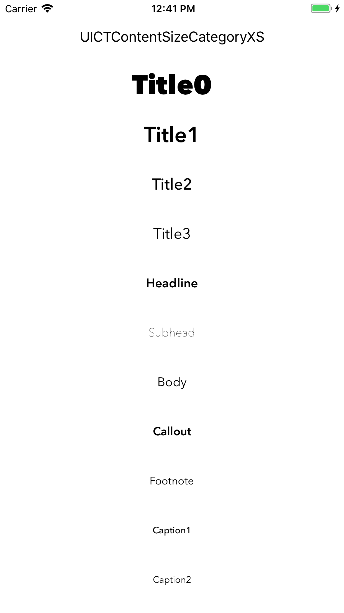
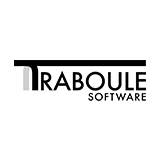

# Font Size Tester for iOS Apps

A quick way to test out a resizable font stack at all sizes via UI testing. For more info, see our [guide over at iOS Dev Recipes](https://www.iosdev.recipes/fonts/ui-font-metrics-and-resizable-text/).

## Installation:

Clone the repo, open the xcodeproj and run in the simulator

## Usage:

Change the fonts listed in `UIFontTextStyle+CustomFont.swift` to your preferences, and then run the app. You can generate a set of screenshots matching all content sizes by running the tests included with the project.

## Supported By:

iOS Dev Recipes and related open source projects are maintained by [Dave Lyon](http://davelyon.net/) and [Traboule Software](https://www.traboulesoftware.com/).

